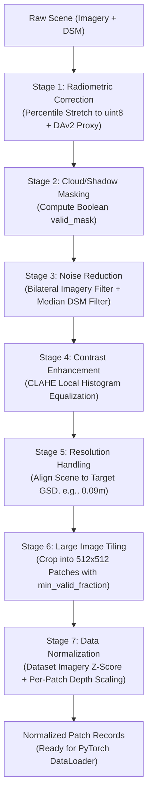
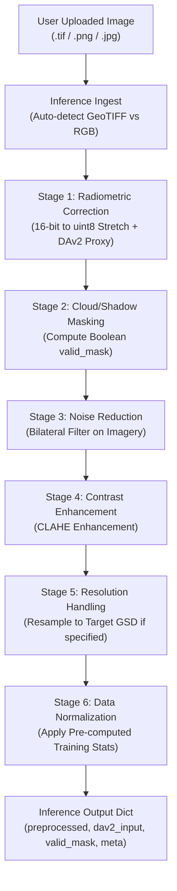

# 00. Overview & Architecture — DepthWizard Pre-Processing Engine

## 1. Executive Summary

The **DepthWizard Pre-Processing Engine** is a high-performance, domain-specific data transformation module designed for high-resolution aerial imagery and Digital Surface Model (DSM) pairs (such as ISPRS Vaihingen and Potsdam benchmark datasets). It transforms raw multi-band, variable-resolution rasters (e.g., 11-bit / 16-bit GeoTIFF, PNG, JPEG) into standardized, normalized tensors ready for consumption by deep learning models (specifically Depth Anything v2 [DAv2] and the DepthWizard Correction U-Net).

---

## 2. Architecture Principles

1. **Dual-Path Design**:
   - **Training Path**: Processes paired high-resolution imagery and ground-truth DSM surfaces into normalized fixed-size patches ($512 \times 512$ or $256 \times 256$).
   - **Inference Path**: Processes single user-uploaded images (RGB PNG/JPG or GeoTIFF) without requiring a DSM, outputting both normalized feature tensors and DAv2-compatible RGB proxies.
2. **Mask-Aware Spatial Processing**:
   - Invalid pixels (nodata, deep cloud cover, extreme cast shadows) are flagged in a single boolean mask (`valid_mask`). Spatial operations (filtering, resampling, statistics computation) utilize this mask to prevent garbage values from polluting valid pixels.
3. **Format & Coordinate System Independence**:
   - Auto-detects CRS (Coordinate Reference System), Ground Sample Distance (GSD in meters/pixel), bit depth, and channel configuration (IR-R-G vs. standard RGB).
4. **Memory-Safe Scalability**:
   - High-resolution gigapixel satellite/aerial scenes are processed using windowed I/O and stitched seamlessly via Cosine-weighted feathered blending.

---

## 3. Dual Pipeline Workflows

### 3.1 Training Pipeline (7 Stages)

The training path requires an **Imagery + DSM pair** as input. It executes 7 strictly ordered stages:

---

### 3.2 Production Inference Pipeline (6 Stages)

The production inference path processes a **single uploaded image** (GeoTIFF, PNG, or JPG) with **no ground-truth DSM**:

---

## 4. Strict Stage Ordering Rationale

The order of the 7 stages is mathematically and algorithmically fixed. Reordering any stage will degrade pipeline output quality or crash execution:

| Order | Stage | Strict Order Justification |
|---|---|---|
| **1** | **Radiometric Correction** | Must run **first** because shadow/cloud detection and noise filtering require normalized 8-bit dynamic range values, not raw 11-bit or 16-bit counts sitting in mixed sensor ranges. |
| **2** | **Cloud & Shadow Masking** | Must run **before noise filtering** so that spatial filters (bilateral/median) can use `valid_mask` to prevent invalid nodata pixels (0 or NaN) from bleeding into neighboring valid ground pixels. |
| **3** | **Noise Reduction** | Must run **before resolution handling** because spatial resampling (zoom/bilinear interpolation) will blend high-frequency sensor noise across resampled grid positions if not cleaned up beforehand. |
| **4** | **Contrast Enhancement** | Must run **after noise reduction** (so CLAHE does not amplify sensor noise) and **before resolution handling** so local histogram equalization operates on native pixel distributions. |
| **5** | **Resolution Handling** | Must run **before tiling** because patch dimensions ($512 \times 512$ pixels) only represent a uniform real-world spatial footprint (e.g., $46.08 \times 46.08$ meters at $0.09\text{m/px}$) once all scenes are on a common GSD. |
| **6** | **Tiling & Patching** | Must run **before dataset normalization** because dataset-level imagery statistics ($\mu, \sigma$) are computed *across pooled patches* from multiple scenes. |
| **7** | **Data Normalization** | Must run **last** to produce zero-mean unit-variance tensors for model consumption. |

---

## 5. Codebase Organization & Module Interfaces

The preprocessing engine is organized under `preprocessing/`:

- **[`preprocessing/stages/`](file:///d:/SIH175/preprocessing/stages)**: Standalone implementation of stages 1 through 7.
- **[`preprocessing/ingest/`](file:///d:/SIH175/preprocessing/ingest)**: Handles raster file I/O, format auto-detection, CRS parsing, and metadata construction.
- **[`preprocessing/pipelines/`](file:///d:/SIH175/preprocessing/pipelines)**: Orchestration scripts connecting stages for training ([`training.py`](file:///d:/SIH175/preprocessing/pipelines/training.py)) and inference ([`inference.py`](file:///d:/SIH175/preprocessing/pipelines/inference.py)).
- **[`preprocessing/tests/`](file:///d:/SIH175/preprocessing/tests)**: 94-test automated test suite and real raster test harnesses.
