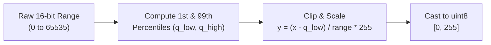

# 01. Stage 1: Radiometric Correction — Technical Specification

- **Source File**: [`preprocessing/stages/radiometric_correction.py`](file:///d:/SIH175/preprocessing/stages/radiometric_correction.py)
- **Module Entrypoint**: `radiometric_correction_pipeline(image_multiband, p_low=1.0, p_high=99.0)`

---

## 1. Problem Statement & Objectives

Aerial sensors (e.g., Leica ADS40/80 airborne digital cameras used in ISPRS benchmarks) capture raw pixel intensities at **11-bit or 16-bit depth** ($0 \dots 2047$ or $0 \dots 65535$). Furthermore, aerial datasets often store non-standard spectral band combinations:
- **ISPRS Vaihingen**: Infrared (NIR), Red (R), Green (G) — 3 channels.
- **Standard Deep Learning Models (e.g., Depth Anything v2)**: Require 8-bit 3-channel RGB ($0 \dots 255$).

Stage 1 solves two core challenges:
1. **Dynamic Range Compression**: Compresses raw 11-bit/16-bit data into standard `uint8` $[0, 255]$ without letting extreme specular reflections or dark shadows distort image contrast.
2. **DAv2 RGB Proxy Construction**: Generates a synthetic 3-channel RGB proxy for models pretrained strictly on natural RGB photos.

---

## 2. Mathematical Foundation

### 2.1 Percentile Contrast Stretching

Standard min-max normalization ($y = \frac{x - x_{min}}{x_{max} - x_{min}} \times 255$) is extremely vulnerable to sensor noise outliers (e.g., a single hot pixel with value 65535 compresses all ground pixels into a tiny dark range).

To prevent this, Stage 1 uses **Percentile Stretching** with lower percentile $p_{low} = 1.0\%$ and upper percentile $p_{high} = 99.0\%$:

$$q_{low} = \text{percentile}(X, p_{low})$$

$$q_{high} = \text{percentile}(X, p_{high})$$

For any pixel value $x_{i,j}$ in channel $C$:

$$y_{i,j} = \text{clip}\left( \frac{x_{i,j} - q_{low}}{\max(q_{high} - q_{low}, \epsilon)} \times 255.0, \; 0.0, \; 255.0 \right)$$

where $\epsilon = 10^{-5}$ prevents division by zero in zero-variance (flat color) regions.



---

### 2.2 DAv2 RGB Proxy Transformation

Depth Anything v2 (DAv2) was trained on natural RGB images. In an Near-Infrared/Red/Green (NIR-R-G) aerial tile:
- Band 0: Near-Infrared (NIR)
- Band 1: Red (R)
- Band 2: Green (G)

Passing NIR directly into DAv2's Red channel distorts features (foliage appears abnormally bright in NIR). Thus, we construct a **DAv2 RGB Proxy** by re-mapping channels:

$$\text{Proxy}_{\text{Red}} = \text{Band}_1 \quad (\text{Native Red})$$

$$\text{Proxy}_{\text{Green}} = \text{Band}_2 \quad (\text{Native Green})$$

$$\text{Proxy}_{\text{Blue}} = \text{Band}_2 \quad (\text{Duplicated Native Green as Blue proxy})$$

This produces visually realistic vegetation and structure contrasts suitable for DAv2 feature extraction.

---

## 3. Function Breakdown & Implementation

### 3.1 `percentile_stretch()`

Stretches a single 2D channel array to `uint8` range $[0, 255]$.

```python
def percentile_stretch(
    band: np.ndarray, p_low: float = 1.0, p_high: float = 99.0
) -> np.ndarray:
    """Stretches a single band to uint8 [0, 255] using lower/upper percentiles."""
    q_low = np.percentile(band, p_low)
    q_high = np.percentile(band, p_high)
    if q_high <= q_low:
        return np.zeros_like(band, dtype=np.uint8)
    stretched = (band.astype(np.float32) - q_low) / (q_high - q_low) * 255.0
    return np.clip(stretched, 0, 255).astype(np.uint8)
```

---

### 3.2 `radiometric_correction_pipeline()`

Main entrypoint for Stage 1. Returns a dictionary containing both the native stretched product (for U-Net) and the DAv2 RGB proxy:

```python
def radiometric_correction_pipeline(
    image_multiband: np.ndarray, p_low: float = 1.0, p_high: float = 99.0
) -> dict[str, np.ndarray]:
    """
    Full Stage 1 pipeline.
    Returns:
        "unet_input": (H, W, C) uint8 native band image
        "dav2_input": (H, W, 3) uint8 RGB proxy for DAv2
    """
    unet_input = stretch_multiband(image_multiband, p_low=p_low, p_high=p_high)
    dav2_input = build_dav2_rgb_proxy(unet_input)
    return {
        "unet_input": unet_input,
        "dav2_input": dav2_input,
    }
```

---

## 4. Edge Cases & Safety Guards

1. **Flat/Constant Color Tiles**: If $q_{high} \le q_{low}$ (e.g., solid black nodata tile), the function returns `np.zeros_like(band, dtype=np.uint8)` to avoid zero-division runtime warnings.
2. **Already `uint8` Input**: If the input is already `uint8` $[0, 255]$ (e.g., standard PNG/JPG upload), percentile stretch still scales brightness cleanly without overflow.
