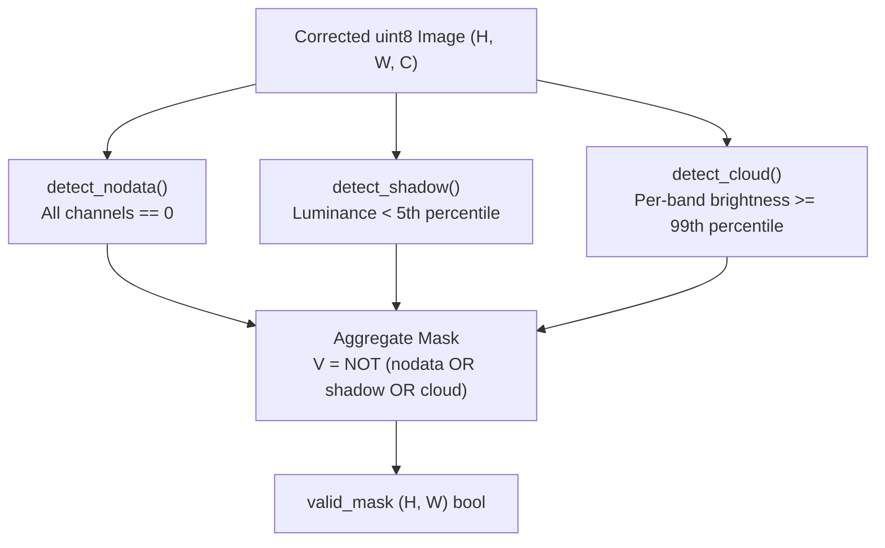

# 02. Stage 2: Cloud & Shadow Masking — Technical Specification

- **Source File**: [`preprocessing/stages/cloud_shadow_masking.py`](file:///d:/SIH175/preprocessing/stages/cloud_shadow_masking.py)
- **Module Entrypoint**: `compute_valid_mask(image, nodata_value=0, shadow_pct=5.0, cloud_pct=99.0)`

---

## 1. Problem Statement & Objectives

Aerial rasters frequently suffer from three non-informative pixel regions:
1. **Nodata Borders**: Collar regions added during orthorectification or tile clipping (usually pixel value 0 or NaN).
2. **Deep Cast Shadows**: Building and tree shadows where optical reflectance is near zero, causing low signal-to-noise ratio.
3. **Cloud Cover & Specular Reflections**: Highly saturated bright regions that obscure ground surface elevation.

Stage 2 synthesizes a **single 2D boolean mask** (`valid_mask` of shape $(H, W)$), where `True` indicates a valid ground surface pixel and `False` indicates an invalid/masked pixel.



---

## 2. Mathematical Heuristics

### 2.1 Nodata Detection

A pixel $(i, j)$ is marked as `nodata` if all spectral channels are equal to `nodata_value` (typically 0):

$$\text{Nodata}_{i,j} = \bigwedge_{c=1}^{C} \left( X_{i,j,c} == \text{nodata\_value} \right)$$

---

### 2.2 Shadow Detection

Shadows are detected using weighted perceptual luminance $L_{i,j}$:

$$L_{i,j} = 0.299 \cdot R_{i,j} + 0.587 \cdot G_{i,j} + 0.114 \cdot B_{i,j}$$

A pixel is classified as shadow if its luminance falls below the $p_{\text{shadow}}$ percentile (default 5th percentile) computed exclusively over currently valid pixels:

$$\tau_{\text{shadow}} = \text{percentile}\left(\{L_{i,j} \mid \neg \text{Nodata}_{i,j}\}, \; p_{\text{shadow}}\right)$$

$$\text{Shadow}_{i,j} = L_{i,j} \le \tau_{\text{shadow}}$$

---

### 2.3 Cloud & Saturation Detection

Clouds and specular rooftop reflections are near-saturated across multiple channels simultaneously. For each channel $c$:

$$\tau_{c} = \text{percentile}\left(\{X_{i,j,c} \mid \text{ValidMask}_{i,j}\}, \; p_{\text{cloud}}\right)$$

$$\text{BrightBands}_{i,j} = \sum_{c=1}^{C} \mathbb{I}\left(X_{i,j,c} \ge \tau_{c}\right)$$

$$\text{Cloud}_{i,j} = \text{BrightBands}_{i,j} \ge \text{min\_bright\_bands}$$

where default $p_{\text{cloud}} = 99.0\%$ and $\text{min\_bright\_bands} = 2$.

---

## 3. Function Breakdown & Implementation

### 3.1 `compute_valid_mask()`

Combines all three mask components into the final boolean matrix:

```python
def compute_valid_mask(
    image: np.ndarray,
    nodata_value: int = 0,
    shadow_pct: float = 5.0,
    cloud_pct: float = 99.0,
) -> np.ndarray:
    """
    Returns boolean mask (H, W): True = valid ground pixel, False = invalid.
    """
    nodata = detect_nodata(image, nodata_value=nodata_value)
    valid = ~nodata

    shadow = detect_shadow(image, shadow_pct, valid_mask=valid)
    valid = valid & ~shadow

    cloud = detect_cloud(image, cloud_pct, valid_mask=valid)
    valid = valid & ~cloud

    return valid
```

---

## 4. Critical Edge-Case Guard: Empty Valid Mask

When an image tile contains 100% nodata or shadow pixels, passing `valid_mask` with all `False` values into `np.percentile()` raises `IndexError: index 0 is out of bounds for axis 0 with size 0`.

To prevent pipeline crashes, `detect_cloud()` includes an explicit early-return guard:

```python
    h, w, c = image.shape
    # Guard: if valid_mask leaves zero valid pixels, return all-False
    if valid_mask is not None and not valid_mask.any():
        return np.zeros((h, w), dtype=bool)
```

This ensures zero-pixel tiles process safely without throwing runtime exceptions.
