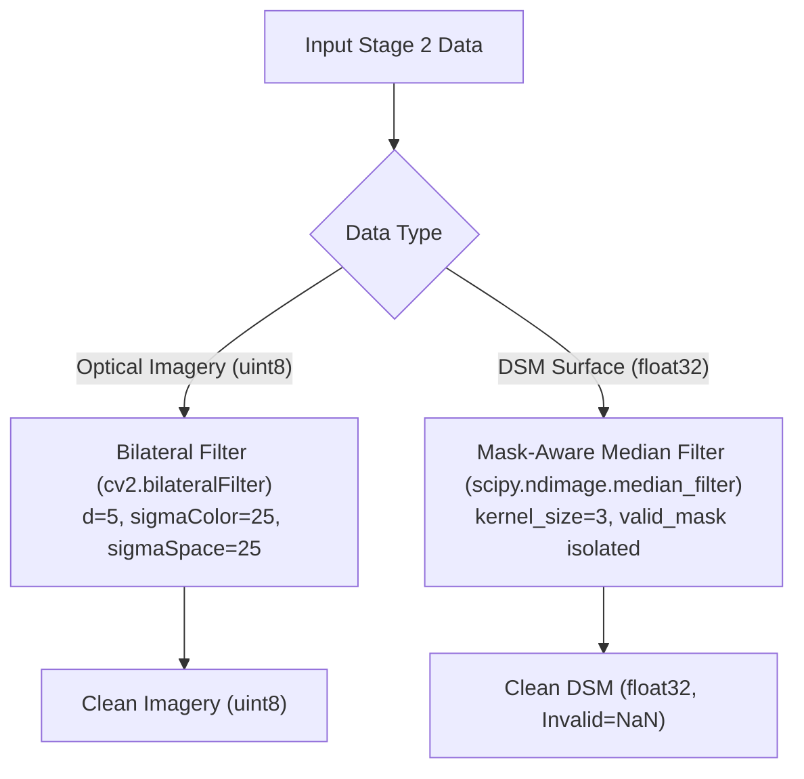

# 03. Stage 3: Noise Reduction — Technical Specification

- **Source File**: [`preprocessing/stages/noise_reduction.py`](file:///d:/SIH175/preprocessing/stages/noise_reduction.py)
- **Functions**: `denoise_imagery(image_uint8)`, `denoise_dsm(dsm_float32, valid_mask)`

---

## 1. Problem Statement & Strategy Selection

Spatial datasets contain two fundamentally different signals requiring distinct noise-reduction strategies:

1. **Optical Imagery**: Sensor shot noise and compression artifacts across flat surfaces (roads, rooftops). Standard Gaussian blur smears crisp building walls and curb boundaries. **Solution**: **Edge-Preserving Bilateral Filtering**.
2. **Digital Surface Models (DSMs)**: LiDAR or stereo-photogrammetry elevation surfaces contain isolated single-pixel height spikes or drops. Gaussian or mean filters spread these outliers into neighboring pixels. **Solution**: **Mask-Aware Median Filtering**.



---

## 2. Mathematical Formulations

### 2.1 Edge-Preserving Bilateral Filter (Imagery)

For a pixel at spatial location $p$, the bilateral filter computes output pixel intensity $I^{\text{filtered}}(p)$ as a weighted sum of neighboring pixels $q \in \Omega$:

$$I^{\text{filtered}}(p) = \frac{1}{W_p} \sum_{q \in \Omega} I(q) \cdot g_{\sigma_s}(\|p - q\|) \cdot g_{\sigma_c}(\|I(p) - I(q)\|)$$

where:
- $g_{\sigma_s}(\|p - q\|) = \exp\left(-\frac{\|p - q\|^2}{2\sigma_s^2}\right)$ is the **spatial domain Gaussian** (penalizes distant pixels).
- $g_{\sigma_c}(\|I(p) - I(q)\|) = \exp\left(-\frac{\|I(p) - I(q)\|^2}{2\sigma_c^2}\right)$ is the **color/intensity domain Gaussian** (penalizes pixels with large color differences, preserving sharp edges).
- $W_p = \sum_{q \in \Omega} g_{\sigma_s}(\|p - q\|) g_{\sigma_c}(\|I(p) - I(q)\|)$ is the normalization factor.

**Selected Parameters**:
- Neighborhood diameter $d = 5$ pixels.
- Color sigma $\sigma_c = 25.0$.
- Spatial sigma $\sigma_s = 25.0$.

---

### 2.2 Mask-Aware Median Filter (DSM Surface)

The non-linear median filter replaces each pixel elevation $Z(p)$ with the median elevation inside a $3 \times 3$ sliding window $\Omega_p$:

$$Z^{\text{filtered}}(p) = \text{median}\left( \{ Z(q) \mid q \in \Omega_p \text{ AND } \text{valid\_mask}(q) = \text{True} \} \right)$$

If $\text{valid\_mask}(p) = \text{False}$, the DSM elevation is explicitly set to `np.nan` to prevent invalid nodata values (e.g., 0 or -9999) from contaminating valid neighborhood medians.

---

## 3. Function Breakdown & Implementation

### 3.1 `denoise_imagery()`

Applies OpenCV's bilateral filter independently across multi-band imagery:

```python
def denoise_imagery(
    image: np.ndarray, d: int = 5, sigma_color: float = 25.0, sigma_space: float = 25.0
) -> np.ndarray:
    """Applies bilateral filter to preserve sharp edges while smoothing flat regions."""
    if image.dtype != np.uint8:
        raise ValueError(f"denoise_imagery expects uint8 image, got {image.dtype}")
    return cv2.bilateralFilter(image, d=d, sigmaColor=sigma_color, sigmaSpace=sigma_space)
```

---

### 3.2 `denoise_dsm()`

Applies mask-isolated median filtering to 2D DSM elevation arrays:

```python
def denoise_dsm(
    dsm: np.ndarray, kernel_size: int = 3, valid_mask: np.ndarray | None = None
) -> np.ndarray:
    """Applies median filter to DSM. Masked invalid pixels are set to NaN."""
    dsm_clean = dsm.astype(np.float32).copy()
    if valid_mask is not None:
        dsm_clean[~valid_mask] = np.nan
    filtered = median_filter(dsm_clean, size=kernel_size, mode="reflect")
    if valid_mask is not None:
        filtered[~valid_mask] = np.nan
    return filtered
```
