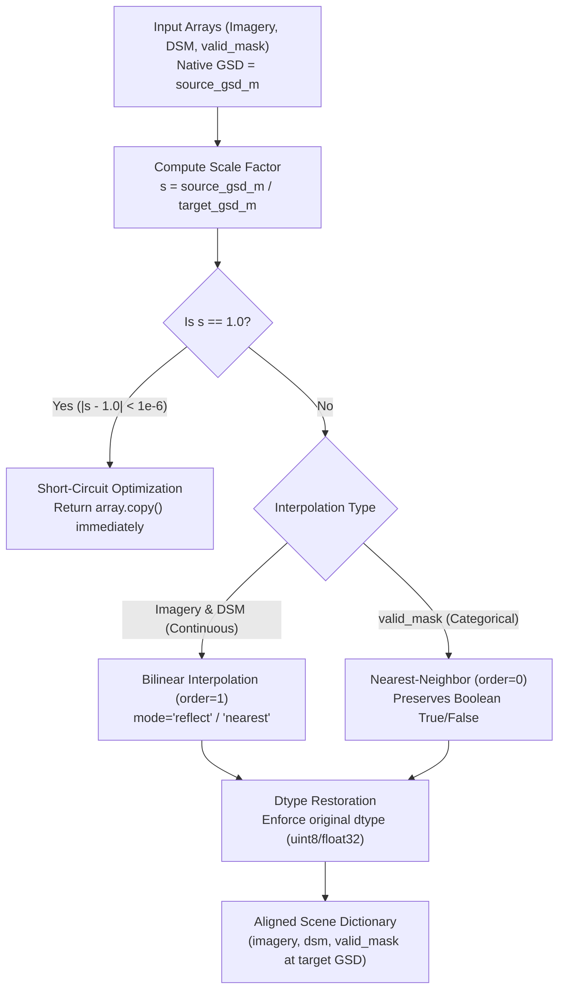

# 05. Stage 5: Resolution Handling — Technical Specification

- **Source File**: [`preprocessing/stages/resolution_handling.py`](file:///d:/SIH175/preprocessing/stages/resolution_handling.py)
- **Functions**: `resample_to_gsd(array, source_gsd_m, target_gsd_m, categorical)`, `align_dataset_to_common_gsd(...)`

---

## 1. Problem Statement & Objectives

Aerial scenes from different flight passes or benchmark datasets are captured at varying spatial resolutions (Ground Sample Distance [GSD] in meters per pixel). For example:
- **ISPRS Vaihingen**: $\sim 0.09\text{ m/pixel}$
- **ISPRS Potsdam**: $\sim 0.05\text{ m/pixel}$
- **Commercial Satellite / Drone**: $0.15\text{ m/pixel} \dots 0.50\text{ m/pixel}$

If unhandled, a $512 \times 512$ pixel patch extracted from Potsdam covers $25.6 \times 25.6$ meters, whereas the same patch from Vaihingen covers $46.08 \times 46.08$ meters. Models trained on mixed raw pixel scales fail to learn physical building depth and height priors.

Stage 5 aligns all scene components (Imagery, DSM, and `valid_mask`) to a single **common target GSD** (default $0.09\text{ m/pixel}$).



---

## 2. Mathematical Formulations & Interpolation Rules

### 2.1 Spatial Scale Factor & Target Dimensions

The spatial scale factor $s$ is defined as:

$$s = \frac{\text{GSD}_{\text{source}}}{\text{GSD}_{\text{target}}}$$

Given source dimensions $(H_{\text{source}}, W_{\text{source}})$, target output dimensions are:

$$H_{\text{target}} = \text{round}(H_{\text{source}} \times s)$$

$$W_{\text{target}} = \text{round}(W_{\text{source}} \times s)$$

---

### 2.2 Interpolation Order Selection

1. **Continuous Datasets (Imagery & DSM)**:
   - Uses **Order 1 Bilinear Interpolation** (`order=1`).
   - Prevents staircasing artifacts across building edges and continuous terrain.
2. **Categorical / Boolean Datasets (`valid_mask`)**:
   - Uses **Order 0 Nearest-Neighbor Interpolation** (`order=0`).
   - Prevents fractional values (e.g., 0.4) from corrupting strict boolean `True` / `False` masks.

---

## 3. Implementation & Critical Dtype Bug Fix

### 3.1 `resample_to_gsd()`

```python
def resample_to_gsd(
    array: np.ndarray,
    source_gsd_m: float,
    target_gsd_m: float,
    categorical: bool = False,
) -> np.ndarray:
    """Resamples a 2D or 3D array to target GSD in meters/pixel."""
    scale_factor = source_gsd_m / target_gsd_m
    if abs(scale_factor - 1.0) < 1e-6:
        return array.copy()

    original_dtype = array.dtype
    order = 0 if categorical else 1

    if array.ndim == 2:
        resample_factors = scale_factor
    elif array.ndim == 3:
        resample_factors = (scale_factor, scale_factor, 1)  # Spatial axes only

    zoomed = zoom(array, resample_factors, order=order, mode="nearest")
    return np.asarray(zoomed, dtype=original_dtype)
```

---

### 3.2 Key Technical Protections

1. **Short-Circuit Optimization**: When $\text{GSD}_{\text{source}} \approx \text{GSD}_{\text{target}}$, skipping `scipy.ndimage.zoom` saves gigabytes of redundant RAM allocations.
2. **`scipy.ndimage.zoom` Dtype Preservation**: `scipy.ndimage.zoom` silently upcasts `uint8` arrays to `float64` during interpolation. Stage 5 explicitly restores `original_dtype` (`uint8` for imagery, `float32` for DSM, `bool` for masks) to prevent memory explosion downstream.
