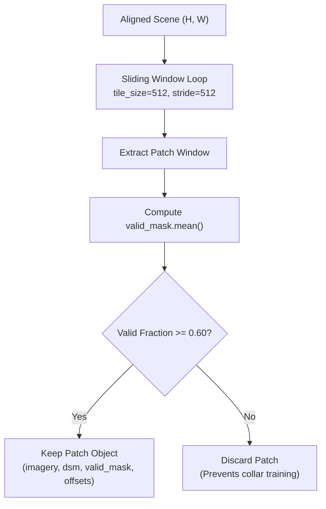
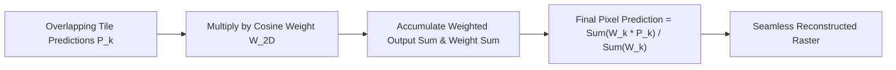

# 06. Stage 6: Tiling & Feathered Stitching — Technical Specification

- **Source Files**: [`preprocessing/stages/tiling.py`](file:///d:/SIH175/preprocessing/stages/tiling.py), [`preprocessing/stages/large_image_tiling.py`](file:///d:/SIH175/preprocessing/stages/large_image_tiling.py)
- **Primary Dataclass**: `Patch(imagery, dsm, valid_mask, row_off, col_off)`

---

## 1. Problem Statement & Objectives

Gigapixel aerial orthophotos (e.g., $10,000 \times 10,000$ pixels) cannot be fed directly into deep neural networks due to GPU memory constraints. Stage 6 serves two distinct purposes:

1. **Training Phase Patch Extraction ([`tiling.py`](file:///d:/SIH175/preprocessing/stages/tiling.py))**: Extracts uniform fixed-size patches ($512 \times 512$), filters out invalid collar patches, and performs spatially disjoint train/val/test splitting.
2. **Inference Phase Feathered Reconstruction ([`large_image_tiling.py`](file:///d:/SIH175/preprocessing/stages/large_image_tiling.py))**: Processes arbitrary large rasters via overlapping sliding windows and stitches predictions back together without seam line artifacts.

---

## 2. Training Patch Extraction & Spatial Splitting

### 2.1 Patch Extraction & Validity Filtering

For an aligned scene of shape $(H, W)$, windows are stepped at stride $S$ (default $S = 512$ for non-overlapping, $S = 256$ for $50\%$ overlap):

$$\text{ValidFraction} = \frac{1}{\text{tile\_size}^2} \sum_{r, c} \text{valid\_mask}(r, c)$$

If $\text{ValidFraction} < \text{min\_valid_fraction}$ (default $0.60$), the patch is discarded:



---

### 2.2 Spatial Area-Based Dataset Splitting

Randomly shuffling patches across an entire aerial orthophoto causes **spatial autocorrelation data leakage** (neighboring patches in the validation set look identical to training patches).

`split_by_area()` divides the scene into spatially isolated horizontal/vertical geographic zones:

```python
def split_by_area(
    patches: list[Patch], train_ratio: float = 0.7, val_ratio: float = 0.15
) -> tuple[list[Patch], list[Patch], list[Patch]]:
    """Splits patches based on spatial offset boundaries to prevent leakage."""
    max_col = max(p.col_off for p in patches)
    train_bound = max_col * train_ratio
    val_bound = max_col * (train_ratio + val_ratio)

    train_p = [p for p in patches if p.col_off < train_bound]
    val_p   = [p for p in patches if train_bound <= p.col_off < val_bound]
    test_p  = [p for p in patches if p.col_off >= val_bound]
    return train_p, val_p, test_p
```

---

## 3. Production Windowed Inference & Cosine-Feathered Stitching

### 3.1 Seam-Line Artifact Problem

When running sliding-window model inference over overlapping tiles, simply averaging overlapping predictions produces sharp grid line artifacts along tile edges.

---

### 3.2 Cosine-Weighted Feathering Formulation

To guarantee smooth, seamless spatial reconstruction, `large_image_tiling.py` constructs a 2D 2-way Cosine-tapered weight matrix $W(r, c)$ over tile dimensions $(T, T)$ with overlap margin $M$:

$$w_{1D}(x) = \begin{cases} 
0.5 \left( 1 - \cos\left( \frac{\pi x}{M} \right) \right) & \text{if } 0 \le x < M \\
1.0 & \text{if } M \le x \le T - M \\
0.5 \left( 1 - \cos\left( \frac{\pi (T - x)}{M} \right) \right) & \text{if } T - M < x \le T 
\end{cases}$$

$$W_{2D}(r, c) = w_{1D}(r) \times w_{1D}(c)$$



---

### 3.3 Reconstruction Accumulator

For each tile prediction $\hat{Y}_k(r, c)$ placed at global scene offsets $(R_k, C_k)$:

$$\hat{Y}_{\text{accum}}(R_k + r, C_k + c) += W_{2D}(r, c) \cdot \hat{Y}_k(r, c)$$

$$W_{\text{accum}}(R_k + r, C_k + c) += W_{2D}(r, c)$$

The final seamless global prediction $\hat{Y}_{\text{final}}$ is normalized by accumulated weights:

$$\hat{Y}_{\text{final}}(r, c) = \frac{\hat{Y}_{\text{accum}}(r, c)}{\max(W_{\text{accum}}(r, c), \; \epsilon)}$$
