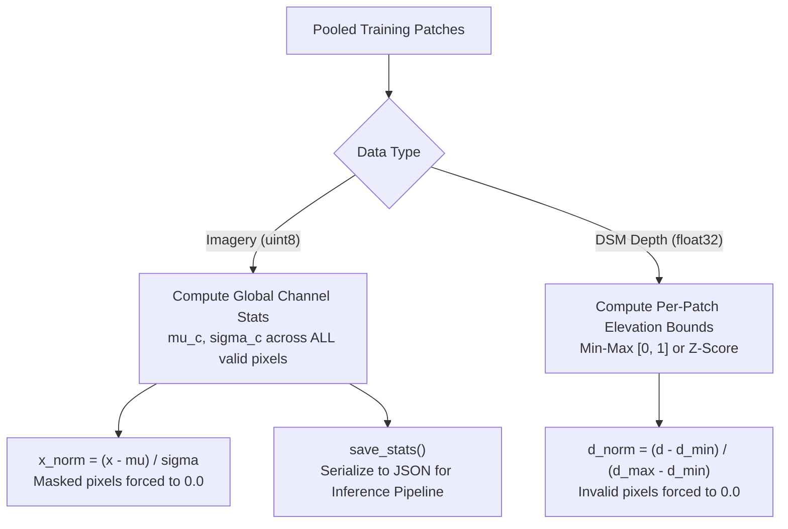

# 07. Stage 7: Data Normalization — Technical Specification

- **Source File**: [`preprocessing/stages/data_normalisation.py`](file:///d:/SIH175/preprocessing/stages/data_normalisation.py)
- **Dataclass**: `ChannelStats(mean, std)`
- **Functions**: `compute_dataset_stats()`, `normalize_image()`, `denormalize_image()`, `normalize_depth_per_patch()`, `denormalize_depth_per_patch()`

---

## 1. Problem Statement & Objectives

Neural networks require zero-mean unit-variance input features for stable backpropagation. However, imagery and ground-truth depth targets have fundamental differences requiring distinct normalization strategies:

1. **Optical Imagery**: Normalized using **Global Dataset-Level Z-Score** statistics ($\mu_c, \sigma_c$) computed across all pooled patches across all training scenes.
2. **Ground-Truth DSM Depth**: Normalized using **Local Per-Patch Scaling** (Min-Max or Z-score) because absolute elevations vary wildly across geographical scenes (e.g., sea level vs. hill tops), but local building height relative to the ground is what the network learns.



---

## 2. Mathematical Formulations

### 2.1 Global Dataset Imagery Statistics

For channel $c \in \{0, 1, 2\}$, given $K$ pooled patches with valid masks $V_k$:

$$\mu_c = \frac{\sum_{k=1}^K \sum_{(r,c) \in V_k} X_{k,r,c,c}}{\sum_{k=1}^K \sum_{(r,c)} \mathbb{I}(V_k(r,c))}$$

$$\sigma_c = \sqrt{ \frac{\sum_{k=1}^K \sum_{(r,c) \in V_k} \left( X_{k,r,c,c} - \mu_c \right)^2}{\sum_{k=1}^K \sum_{(r,c)} \mathbb{I}(V_k(r,c))} }$$

Forward Z-score normalization for image tensor $X$:

$$\hat{X}_{r,c,c} = \frac{X_{r,c,c} - \mu_c}{\max(\sigma_c, \; \epsilon)}$$

---

### 2.2 Local Per-Patch Depth Normalization (Min-Max)

For a single patch DSM elevation array $D$, computed over valid ground pixels $V$:

$$D_{\text{min}} = \min_{r,c \in V} D(r, c)$$

$$D_{\text{max}} = \max_{r,c \in V} D(r, c)$$

$$\Delta D = D_{\text{max}} - D_{\text{min}}$$

For valid pixels $(r,c) \in V$:

$$\hat{D}(r, c) = \frac{D(r, c) - D_{\text{min}}}{\max(\Delta D, \; \epsilon)}$$

For invalid pixels $(r,c) \notin V$, $\hat{D}(r, c) = 0.0$.

---

### 2.3 Degenerate Flat Patch Guard

If $D_{\text{max}} \le D_{\text{min}}$ (e.g., a completely flat water body or flat concrete roof patch), $\Delta D = 0$.

Stage 7 detects degenerate patches, sets $\hat{D} = 0.0$, and stores `params["degenerate"] = True` in the patch metadata record. This prevents zero-division NaN propagation during loss computation.

---

## 3. Function Breakdown & Implementation

### 3.1 `compute_dataset_stats()`

```python
def compute_dataset_stats(
    images: list[np.ndarray], masks: list[np.ndarray] | None = None
) -> ChannelStats:
    """Computes per-channel mean and std across a list of imagery patches."""
    means, stds = [], []
    num_channels = images[0].shape[2]
    for c in range(num_channels):
        valid_pixels = []
        for i, img in enumerate(images):
            band = img[..., c].astype(np.float32)
            m = masks[i] if masks is not None else np.ones(band.shape, dtype=bool)
            valid_pixels.append(band[m])
        all_pixels = np.concatenate(valid_pixels)
        means.append(float(all_pixels.mean()))
        stds.append(float(all_pixels.std()))
    return ChannelStats(mean=means, std=stds)
```

---

### 3.2 `save_stats()` & Production De-normalization

During training, `save_stats(stats, "stats.json")` serializes channel parameters.

During production inference, the inverse transform recovers absolute physical units:

$$X_{\text{recovered}} = \hat{X} \cdot \sigma_c + \mu_c$$

$$D_{\text{recovered}} = \hat{D} \cdot (D_{\text{max}} - D_{\text{min}}) + D_{\text{min}}$$
