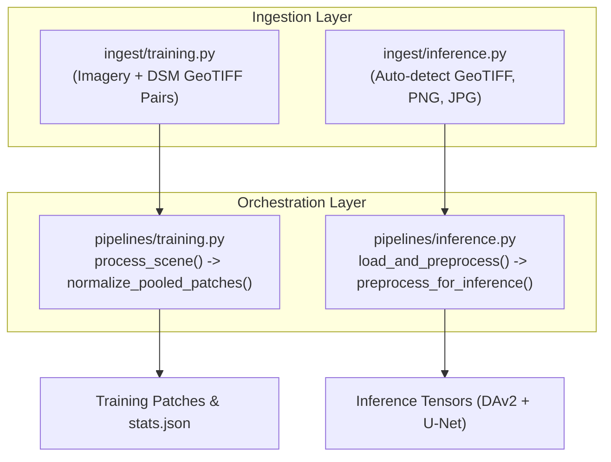

# 08. Ingest & Pipeline Orchestration — Technical Specification

- **Source Folders**: [`preprocessing/ingest/`](file:///d:/SIH175/preprocessing/ingest), [`preprocessing/pipelines/`](file:///d:/SIH175/preprocessing/pipelines)
- **Key Modules**:
  - `preprocessing/ingest/training.py` & `preprocessing/ingest/inference.py`
  - `preprocessing/pipelines/training.py` & `preprocessing/pipelines/inference.py`

---

## 1. Architecture Overview

The ingestion and orchestration layer decouples raw file I/O and format parsing from the core spatial transformation stages. It provides a uniform interface for two distinct operational modes:



---

## 2. Ingestion Subsystem (`preprocessing/ingest/`)

### 2.1 Training Ingest (`ingest/training.py`)

Loads paired geospatial scenes:
- `load_imagery_tif(path)`: Reads multi-band (IR-R-G) GeoTIFF array and extracts native GSD (`SceneMeta.gsd_m`).
- `load_dsm_tif(path)`: Reads single-band float32 elevation raster.
- `load_scene(imagery_path, dsm_path)`: Verifies spatial dimension compatibility between imagery and DSM.

---

### 2.2 Production Inference Ingest (`ingest/inference.py`)

Handles single-image user uploads across multiple file formats without requiring a ground-truth DSM:

```python
@dataclass
class InferenceImageMeta:
    filename: str
    width: int
    height: int
    count: int
    dtype: str
    is_georeferenced: bool
    crs: str | None = None
    transform: tuple[float, ...] | None = None
    gsd_m: float | None = None
    user_gsd_m: float | None = None
```

#### Auto-Detection Logic:
1. **GeoTIFF (`.tif`, `.tiff`)**: Uses `rasterio` to inspect affine transformation matrix ($transform$) and Coordinate Reference System ($CRS$). Calculates native GSD:
   $$\text{GSD} = \sqrt{|a \cdot e - b \cdot d|}$$
2. **Standard RGB (`.png`, `.jpg`, `.jpeg`)**: Uses `PIL.Image` or `cv2.imread`. Sets `is_georeferenced = False` and `gsd_m = None`. If `user_gsd_m` is supplied by the user, it is attached to `meta`.

---

## 3. Pipeline Orchestrators (`preprocessing/pipelines/`)

### 3.1 Training Orchestrator (`pipelines/training.py`)

Orchestrates stages 1 through 6 for a single training scene:

```python
def process_scene(
    raw_ir_r_g: np.ndarray,
    raw_dsm: np.ndarray,
    source_gsd_m: float,
    target_gsd_m: float = 0.09,
    tile_size: int = 512,
    stride: int | None = None,
    min_valid_fraction: float = 0.6,
) -> list[Patch]:
    # Stage 1: Radiometric Correction
    corrected = radiometric_correction_pipeline(raw_ir_r_g)
    unet_img = corrected["unet_input"]

    # Stage 2: Masking
    valid_mask = compute_valid_mask(unet_img)

    # Stage 3: Noise Reduction
    denoised_img = denoise_imagery(unet_img)
    denoised_dsm = denoise_dsm(raw_dsm, valid_mask=valid_mask)

    # Stage 4: Contrast Enhancement (CLAHE)
    enhanced_img = enhance_contrast(denoised_img, valid_mask=valid_mask)

    # Stage 5: Resolution Handling
    aligned = align_dataset_to_common_gsd(enhanced_img, denoised_dsm, valid_mask, source_gsd_m, target_gsd_m)

    # Stage 6: Tiling
    patches = crop_patches(aligned["imagery"], aligned["dsm"], aligned["valid_mask"], tile_size=tile_size)
    return patches
```

---

### 3.2 Production Inference Orchestrator (`pipelines/inference.py`)

Processes a single uploaded image for model prediction (bypassing DSM steps):

```python
def load_and_preprocess(
    image_path: str,
    user_gsd_m: float | None = None,
    target_gsd_m: float | None = None,
    imagery_stats: ChannelStats | None = None,
) -> dict:
    """Top-level production entrypoint."""
    image, meta = load_inference_image(image_path, user_gsd_m=user_gsd_m)
    return preprocess_for_inference(
        image, meta, target_gsd_m=target_gsd_m, imagery_stats=imagery_stats
    )
```
