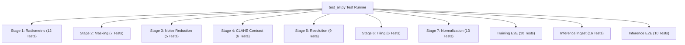

# 09. Testing & Verification Guide — Technical Specification

- **Source Folder**: [`preprocessing/tests/`](file:///d:/SIH175/preprocessing/tests)
- **Primary Test Runner**: [`preprocessing/tests/test_all.py`](file:///d:/SIH175/preprocessing/tests/test_all.py)
- **Real Image Test Harness**: [`preprocessing/tests/test_real_tif.py`](file:///d:/SIH175/preprocessing/tests/test_real_tif.py)
- **Synthetic Raster Generator**: [`preprocessing/tests/make_synthetic_tif.py`](file:///d:/SIH175/preprocessing/tests/make_synthetic_tif.py)

---

## 1. Overview & Test Architecture

The DepthWizard preprocessing module features a **94-test automated test suite** that validates every algorithm, mathematical formula, array data type, edge-case guard, and pipeline path before code deployment.



---

## 2. Test Taxonomy (94 Tests Total)

| Test Group | Test Function | Test Count | Key Invariants Validated |
|---|---|---|---|
| **1. Radiometric Correction** | `test_radiometric_correction()` | 12 | `uint8` output range $[0, 255]$, percentile stretching correctness, DAv2 proxy channel mapping (`R, G, G`). |
| **2. Cloud & Shadow Masking** | `test_cloud_shadow_masking()` | 7 | Nodata zero-row detection, luminance shadow flagging, saturated cloud detection, zero-pixel array crash guard. |
| **3. Noise Reduction** | `test_noise_reduction()` | 5 | Bilateral filter edge preservation, DSM median filter spike reduction, `NaN` boundary isolation. |
| **4. Contrast Enhancement** | `test_contrast_enhancement()` | 6 | CLAHE pixel modification, tile grid scaling, `valid_mask` zeroing, float32 input rejection. |
| **5. Resolution Handling** | `test_resolution_handling()` | 9 | Identity resample short-circuit, downsampling spatial dims, bilinear vs nearest-neighbor interpolation, `uint8` dtype preservation. |
| **6. Tiling** | `test_tiling()` | 6 | Non-overlapping patch cropping, patch shape matching, `min_valid_fraction` patch filtering. |
| **7. Data Normalization** | `test_data_normalization()` | 13 | Channel stats ($\mu, \sigma$), Z-score round-trip, per-patch depth Min-Max $[0, 1]$, degenerate flat patch guards. |
| **8. Training E2E** | `test_training_pipeline_e2e()` | 10 | 7-stage end-to-end processing, non-NaN DSM guarantee, `stats.json` serialization round-trip. |
| **9. Inference Ingest** | `test_inference_ingest()` | 16 | PNG/JPG auto-detection, GeoTIFF projected CRS & affine GSD parsing, user GSD overrides, missing file errors. |
| **10. Inference E2E** | `test_inference_pipeline_e2e()` | 10 | 6-stage production inference pipeline, float32 tensor output, boolean `valid_mask`, DAv2 `uint8` proxy output. |

---

## 3. How to Run Verification Scripts

### 3.1 Running the Full Automated Test Suite

Execute the following command from the workspace root directory:

```bash
uv run python preprocessing/tests/test_all.py
```

**Expected Terminal Output**:
```text
======================================================================
RESULTS: 94 passed, 0 failed, 94 total
======================================================================

[OK] ALL TESTS PASSED - preprocessing pipeline is fully verified.
```

---

### 3.2 Testing a Custom Raster File (`test_real_tif.py`)

To verify the production inference pipeline on a custom GeoTIFF, PNG, or JPEG file:

```bash
uv run python preprocessing/tests/test_real_tif.py "path/to/your/image.tif"
```

**Output Diagnostics**:
- File I/O format & dimensions
- Native GSD & CRS metadata
- Elapsed pipeline execution time
- Valid ground pixel fraction (`valid_mask.mean()`)
- Tensor shapes & data types ready for DAv2 & Correction U-Net
